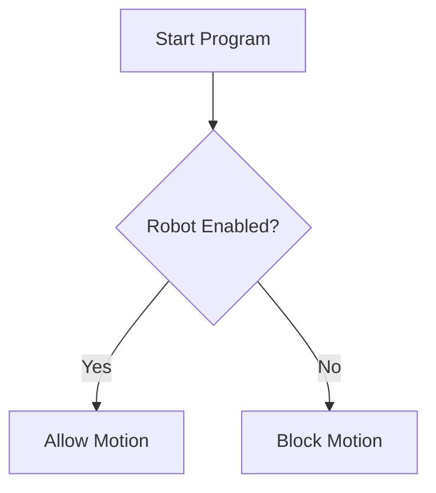
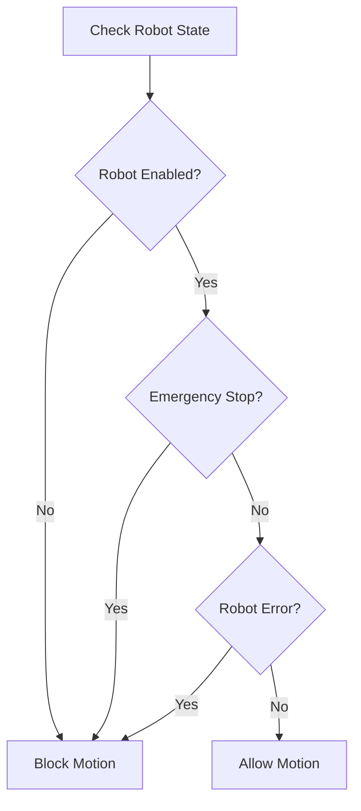
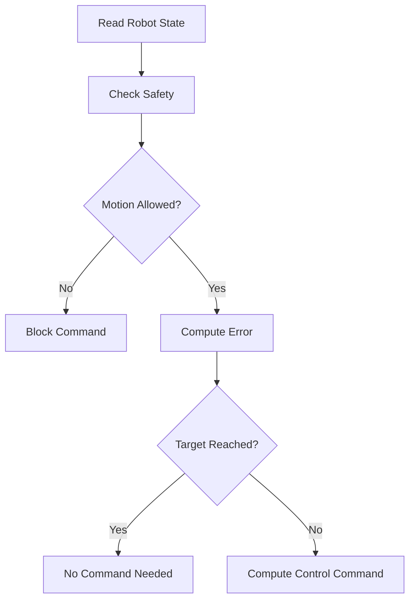

# Lesson 3 — Operators, Conditions, and Robot Safety Logic

Owner: ttn

## 1. Goal

In this lesson, you will learn how to make decisions in C++.

You will study:

```cpp
if
else
else if
>, <, >=, <=
==, !=
&&
||
std::abs()
```

This lesson is very important for robotics because robot programs must always check conditions such as:

```
Is the robot enabled?
Is emergency stop pressed?
Is the joint error small enough?
Is the target reached?
Is the joint position inside the safety limit?
```

---

# 2. Why Conditions Are Important in ROS 2 Robotics

In real robot control, you cannot command the robot blindly.

For example:

```cpp
if (emergency_stop == true)
{
    std::cout << "Stop robot immediately!" << std::endl;
}
```

Or:

```cpp
if (std::abs(position_error) < tolerance)
{
    std::cout << "Target reached" << std::endl;
}
```

Later in ROS 2, this kind of logic becomes:

```cpp
if (robot_enabled_ && !emergency_stop_)
{
    publishCommand();
}
else
{
    stopRobot();
}
```

So before learning ROS 2 publishers, subscribers, and controllers, you must understand C++ decision logic clearly.

---

# 3. Basic Comparison Operators

Comparison operators compare values.

| Operator | Meaning | Example |
| --- | --- | --- |
| `>` | greater than | `error > 0.1` |
| `<` | less than | `error < 0.1` |
| `>=` | greater than or equal | `position >= min_limit` |
| `<=` | less than or equal | `position <= max_limit` |
| `==` | equal to | `robot_enabled == true` |
| `!=` | not equal to | `mode != "error"` |

Important mistake:

```cpp
if (robot_enabled = true)
```

This is wrong for comparison.

Correct:

```cpp
if (robot_enabled == true)
```

However, for boolean variables, the better style is:

```cpp
if (robot_enabled)
```

and:

```cpp
if (!emergency_stop)
```

---

# 4. First Program: Check Robot Enabled State

Create today’s lesson folder:

```bash
mkdir -p ~/cpp_ros2_study/lesson_03
cd ~/cpp_ros2_study/lesson_03
```

Create a file:

```bash
code robot_enabled_check.cpp
```

Or:

```bash
nano robot_enabled_check.cpp
```

Write this code:

```cpp
#include <iostream>
#include <string>

int main()
{
    std::string robot_name = "OpenManipulator-X";
    bool robot_enabled = true;

    std::cout << std::boolalpha;

    std::cout << "Robot name: " << robot_name << std::endl;
    std::cout << "Robot enabled: " << robot_enabled << std::endl;

    if (robot_enabled)
    {
        std::cout << "Robot is ready to move." << std::endl;
    }
    else
    {
        std::cout << "Robot is disabled. Motion is not allowed." << std::endl;
    }

    return 0;
}
```

Compile:

```bash
g++ robot_enabled_check.cpp -o robot_enabled_check
```

Run:

```bash
./robot_enabled_check
```

Expected output:

```
Robot name: OpenManipulator-X
Robot enabled: true
Robot is ready to move.
```

Now change:

```cpp
bool robot_enabled = true;
```

to:

```cpp
bool robot_enabled = false;
```

Compile and run again:

```bash
g++ robot_enabled_check.cpp -o robot_enabled_check
./robot_enabled_check
```

Expected output:

```
Robot name: OpenManipulator-X
Robot enabled: false
Robot is disabled. Motion is not allowed.
```

---

# 5. Line-by-Line Explanation

## Boolean variable

```cpp
bool robot_enabled = true;
```

This stores whether the robot is enabled.

It can only be:

```
true
false
```

---

## If condition

```cpp
if (robot_enabled)
```

This means:

```
If robot_enabled is true, run the code inside this block.
```

---

## If block

```cpp
{
    std::cout << "Robot is ready to move." << std::endl;
}
```

This block runs only when the condition is true.

---

## Else block

```cpp
else
{
    std::cout << "Robot is disabled. Motion is not allowed." << std::endl;
}
```

This block runs when the condition is false.

---

# 6. Robotics Meaning

This simple code already represents a real safety idea:



In real robot software, you should never send motion commands before checking whether the robot is enabled.

---

# 7. Second Program: Emergency Stop Logic

Create a new file:

```bash
code emergency_stop_check.cpp
```

Write:

```cpp
#include <iostream>
#include <string>

int main()
{
    std::string robot_name = "TM14S-M";

    bool robot_enabled = true;
    bool emergency_stop = false;

    std::cout << std::boolalpha;

    std::cout << "Robot name: " << robot_name << std::endl;
    std::cout << "Robot enabled: " << robot_enabled << std::endl;
    std::cout << "Emergency stop: " << emergency_stop << std::endl;

    if (emergency_stop)
    {
        std::cout << "EMERGENCY STOP ACTIVE!" << std::endl;
        std::cout << "Robot motion is blocked." << std::endl;
    }
    else
    {
        std::cout << "Emergency stop is not active." << std::endl;
    }

    return 0;
}
```

Compile and run:

```bash
g++ emergency_stop_check.cpp -o emergency_stop_check
./emergency_stop_check
```

Expected output:

```
Robot name: TM14S-M
Robot enabled: true
Emergency stop: false
Emergency stop is not active.
```

Now change:

```cpp
bool emergency_stop = false;
```

to:

```cpp
bool emergency_stop = true;
```

Run again.

Expected output:

```
Robot name: TM14S-M
Robot enabled: true
Emergency stop: true
EMERGENCY STOP ACTIVE!
Robot motion is blocked.
```

---

# 8. Logical Operators

Robots usually need to check multiple conditions at the same time.

## AND operator: `&&`

```cpp
if (robot_enabled && !emergency_stop)
```

Meaning:

```
Robot can move only if:
robot_enabled is true
AND
emergency_stop is false
```

## OR operator: `||`

```cpp
if (emergency_stop || robot_error)
```

Meaning:

```
Stop the robot if:
emergency_stop is true
OR
robot_error is true
```

## NOT operator: `!`

```cpp
if (!emergency_stop)
```

Meaning:

```
If emergency_stop is not active
```

---

# 9. Third Program: Safe Motion Permission

Create:

```bash
code safe_motion_check.cpp
```

Write:

```cpp
#include <iostream>
#include <string>

int main()
{
    std::string robot_name = "OpenManipulator-X";

    bool robot_enabled = true;
    bool emergency_stop = false;
    bool robot_error = false;

    std::cout << std::boolalpha;

    std::cout << "Robot name: " << robot_name << std::endl;
    std::cout << "Robot enabled: " << robot_enabled << std::endl;
    std::cout << "Emergency stop: " << emergency_stop << std::endl;
    std::cout << "Robot error: " << robot_error << std::endl;

    if (robot_enabled && !emergency_stop && !robot_error)
    {
        std::cout << "Motion allowed." << std::endl;
    }
    else
    {
        std::cout << "Motion blocked." << std::endl;
    }

    return 0;
}
```

Compile:

```bash
g++ safe_motion_check.cpp -o safe_motion_check
```

Run:

```bash
./safe_motion_check
```

Expected output:

```
Robot name: OpenManipulator-X
Robot enabled: true
Emergency stop: false
Robot error: false
Motion allowed.
```

Now test different cases.

Case 1:

```cpp
bool robot_enabled = false;
bool emergency_stop = false;
bool robot_error = false;
```

Result:

```
Motion blocked.
```

Case 2:

```cpp
bool robot_enabled = true;
bool emergency_stop = true;
bool robot_error = false;
```

Result:

```
Motion blocked.
```

Case 3:

```cpp
bool robot_enabled = true;
bool emergency_stop = false;
bool robot_error = true;
```

Result:

```
Motion blocked.
```

Only this case allows motion:

```cpp
bool robot_enabled = true;
bool emergency_stop = false;
bool robot_error = false;
```

---

# 10. Safety Logic Diagram



This logic is simple, but it is very close to real robot software.

---

# 11. Fourth Program: Check Target Reached

In robot control, you usually check:

```
error = target_position - current_position
```

If the absolute error is small enough, the robot reached the target.

For example:

```
target_position = 1.0 rad
current_position = 0.98 rad
error = 0.02 rad
```

If tolerance is:

```
0.05 rad
```

Then:

```
0.02 < 0.05
```

So the target is reached.

---

Create a file:

```bash
code target_reached_check.cpp
```

Write:

```cpp
#include <cmath>
#include <iostream>
#include <string>

int main()
{
    std::string joint_name = "joint1";

    double target_position = 1.0;
    double current_position = 0.98;
    double tolerance = 0.05;

    double position_error = target_position - current_position;
    double absolute_error = std::abs(position_error);

    std::cout << "Joint name: " << joint_name << std::endl;
    std::cout << "Target position: " << target_position << " rad" << std::endl;
    std::cout << "Current position: " << current_position << " rad" << std::endl;
    std::cout << "Position error: " << position_error << " rad" << std::endl;
    std::cout << "Absolute error: " << absolute_error << " rad" << std::endl;
    std::cout << "Tolerance: " << tolerance << " rad" << std::endl;

    if (absolute_error < tolerance)
    {
        std::cout << "Target reached." << std::endl;
    }
    else
    {
        std::cout << "Target not reached yet." << std::endl;
    }

    return 0;
}
```

Compile:

```bash
g++ target_reached_check.cpp -o target_reached_check
```

Run:

```bash
./target_reached_check
```

Expected output:

```
Joint name: joint1
Target position: 1 rad
Current position: 0.98 rad
Position error: 0.02 rad
Absolute error: 0.02 rad
Tolerance: 0.05 rad
Target reached.
```

---

# 12. Why Use `std::abs()`?

Suppose:

```cpp
double target_position = 1.0;
double current_position = 1.08;
```

Then:

```
error = 1.0 - 1.08 = -0.08
```

The error is negative because the joint moved past the target.

But for checking target reached, we usually only care about the size of the error.

So:

```cpp
std::abs(-0.08)
```

becomes:

```
0.08
```

That is why we use:

```cpp
double absolute_error = std::abs(position_error);
```

Remember to include:

```cpp
#include <cmath>
```

---

# 13. Fifth Program: Joint Limit Safety Check

Every robot joint has limits.

Example:

```
joint1 minimum limit = -2.9 rad
joint1 maximum limit = 2.9 rad
```

Before commanding a target, you should check:

```
target_position >= min_limit
AND
target_position <= max_limit
```

Create:

```bash
code joint_limit_check.cpp
```

Write:

```cpp
#include <iostream>
#include <string>

int main()
{
    std::string joint_name = "joint1";

    double target_position = 3.2;

    double min_limit = -2.9;
    double max_limit = 2.9;

    std::cout << "Joint name: " << joint_name << std::endl;
    std::cout << "Target position: " << target_position << " rad" << std::endl;
    std::cout << "Minimum limit: " << min_limit << " rad" << std::endl;
    std::cout << "Maximum limit: " << max_limit << " rad" << std::endl;

    if (target_position >= min_limit && target_position <= max_limit)
    {
        std::cout << "Target is inside joint limit." << std::endl;
        std::cout << "Command is safe." << std::endl;
    }
    else
    {
        std::cout << "Target is outside joint limit!" << std::endl;
        std::cout << "Command is rejected." << std::endl;
    }

    return 0;
}
```

Compile and run:

```bash
g++ joint_limit_check.cpp -o joint_limit_check
./joint_limit_check
```

Expected output:

```
Joint name: joint1
Target position: 3.2 rad
Minimum limit: -2.9 rad
Maximum limit: 2.9 rad
Target is outside joint limit!
Command is rejected.
```

Now change:

```cpp
double target_position = 3.2;
```

to:

```cpp
double target_position = 1.5;
```

Expected result:

```
Target is inside joint limit.
Command is safe.
```

---

# 14. `else if` for Robot State

Sometimes the robot can have many states.

Example:

```
0 = idle
1 = moving
2 = error
3 = emergency stop
```

Create:

```bash
code robot_state_check.cpp
```

Write:

```cpp
#include <iostream>
#include <string>

int main()
{
    int robot_state = 1;

    if (robot_state == 0)
    {
        std::cout << "Robot state: IDLE" << std::endl;
    }
    else if (robot_state == 1)
    {
        std::cout << "Robot state: MOVING" << std::endl;
    }
    else if (robot_state == 2)
    {
        std::cout << "Robot state: ERROR" << std::endl;
    }
    else if (robot_state == 3)
    {
        std::cout << "Robot state: EMERGENCY STOP" << std::endl;
    }
    else
    {
        std::cout << "Robot state: UNKNOWN" << std::endl;
    }

    return 0;
}
```

Compile:

```bash
g++ robot_state_check.cpp -o robot_state_check
./robot_state_check
```

Expected output:

```
Robot state: MOVING
```

Change:

```cpp
int robot_state = 1;
```

to:

```cpp
int robot_state = 2;
```

Expected output:

```
Robot state: ERROR
```

---

# 15. Better Practice: Use Meaningful State Names Later

For now, using numbers is okay.

But later, professional C++ uses `enum class`.

Example preview:

```cpp
enum class RobotState
{
    IDLE,
    MOVING,
    ERROR,
    EMERGENCY_STOP
};
```

We will study this later.

For now, understand `if`, `else if`, and `else`.

---

# 16. Integrated Example: Safe P Controller

Now let us combine Lesson 2 and Lesson 3.

We will make a simple P controller, but it only sends a command when the system is safe.

Control law:

```
error = target - current
command = kp × error
```

Safety logic:

```
Motion allowed only if:
robot_enabled == true
emergency_stop == false
robot_error == false
target inside joint limit
```

Create:

```bash
code safe_p_controller.cpp
```

Write:

```cpp
#include <cmath>
#include <iostream>
#include <string>

int main()
{
    std::string robot_name = "OpenManipulator-X";
    std::string joint_name = "joint2";

    bool robot_enabled = true;
    bool emergency_stop = false;
    bool robot_error = false;

    double target_position = -1.2;
    double current_position = -0.9;

    double min_limit = -2.0;
    double max_limit = 2.0;

    double kp = 8.0;
    double tolerance = 0.05;

    double position_error = target_position - current_position;
    double absolute_error = std::abs(position_error);
    double control_command = kp * position_error;

    bool target_inside_limit =
        target_position >= min_limit && target_position <= max_limit;

    bool motion_allowed =
        robot_enabled && !emergency_stop && !robot_error && target_inside_limit;

    std::cout << std::boolalpha;

    std::cout << "Robot name: " << robot_name << std::endl;
    std::cout << "Joint name: " << joint_name << std::endl;
    std::cout << "Robot enabled: " << robot_enabled << std::endl;
    std::cout << "Emergency stop: " << emergency_stop << std::endl;
    std::cout << "Robot error: " << robot_error << std::endl;
    std::cout << "Target inside limit: " << target_inside_limit << std::endl;
    std::cout << "Motion allowed: " << motion_allowed << std::endl;

    std::cout << "Target position: " << target_position << " rad" << std::endl;
    std::cout << "Current position: " << current_position << " rad" << std::endl;
    std::cout << "Position error: " << position_error << " rad" << std::endl;
    std::cout << "Absolute error: " << absolute_error << " rad" << std::endl;

    if (!motion_allowed)
    {
        std::cout << "Controller blocked. No command is sent." << std::endl;
    }
    else if (absolute_error < tolerance)
    {
        std::cout << "Target already reached. No command needed." << std::endl;
    }
    else
    {
        std::cout << "Controller active." << std::endl;
        std::cout << "Control command: " << control_command << std::endl;
    }

    return 0;
}
```

Compile:

```bash
g++ safe_p_controller.cpp -o safe_p_controller
```

Run:

```bash
./safe_p_controller
```

Expected output:

```
Robot name: OpenManipulator-X
Joint name: joint2
Robot enabled: true
Emergency stop: false
Robot error: false
Target inside limit: true
Motion allowed: true
Target position: -1.2 rad
Current position: -0.9 rad
Position error: -0.3 rad
Absolute error: 0.3 rad
Controller active.
Control command: -2.4
```

This is a very important program.

It already contains the basic structure of a real robot controller:



---

# 17. Important Style Rules

## Rule 1 — Prefer clear boolean names

Good:

```cpp
bool robot_enabled = true;
bool emergency_stop = false;
bool target_inside_limit = true;
bool motion_allowed = true;
```

Bad:

```cpp
bool a = true;
bool b = false;
bool c = true;
```

---

## Rule 2 — Avoid complicated conditions inside `if`

Hard to read:

```cpp
if (robot_enabled && !emergency_stop && !robot_error && target_position >= min_limit && target_position <= max_limit)
```

Better:

```cpp
bool target_inside_limit =
    target_position >= min_limit && target_position <= max_limit;

bool motion_allowed =
    robot_enabled && !emergency_stop && !robot_error && target_inside_limit;

if (motion_allowed)
{
    std::cout << "Motion allowed." << std::endl;
}
```

This is much easier to debug.

---

## Rule 3 — Use `std::abs()` for error magnitude

For target reached checking, use:

```cpp
if (std::abs(position_error) < tolerance)
```

Do not write only:

```cpp
if (position_error < tolerance)
```

because this can be wrong when the error is negative.

Example:

```
position_error = -10.0
tolerance = 0.05
```

This condition is true:

```cpp
position_error < tolerance
```

because:

```
-10.0 < 0.05
```

But the robot is definitely not close to the target.

Correct:

```cpp
std::abs(position_error) < tolerance
```

---

# 18. Common Errors

## Error 1 — Using `=` instead of `==`

Wrong:

```cpp
if (robot_state = 1)
```

Correct:

```cpp
if (robot_state == 1)
```

`=` means assign value.

`==` means compare value.

---

## Error 2 — Missing `#include <cmath>`

Wrong:

```cpp
#include <iostream>

double error = std::abs(position_error);
```

Correct:

```cpp
#include <cmath>
#include <iostream>
```

You need `<cmath>` for `std::abs()`.

---

## Error 3 — Forgetting braces

This works:

```cpp
if (robot_enabled)
    std::cout << "Motion allowed." << std::endl;
```

But for beginner robotics programming, use braces always:

```cpp
if (robot_enabled)
{
    std::cout << "Motion allowed." << std::endl;
}
```

This prevents mistakes when you add more lines later.

---

## Error 4 — Wrong logical operator

Wrong:

```cpp
if (robot_enabled || !emergency_stop)
```

This may allow motion even when one condition is unsafe.

Usually for safety permission, use `&&`:

```cpp
if (robot_enabled && !emergency_stop)
```

Meaning:

```
All safety conditions must be true.
```

---

# 19. Practice Tasks

## Practice 1 — Test Emergency Stop

In `safe_p_controller.cpp`, change:

```cpp
bool emergency_stop = false;
```

to:

```cpp
bool emergency_stop = true;
```

Expected result:

```
Motion allowed: false
Controller blocked. No command is sent.
```

---

## Practice 2 — Test Joint Limit

Change:

```cpp
double target_position = -1.2;
```

to:

```cpp
double target_position = -3.0;
```

Expected result:

```
Target inside limit: false
Motion allowed: false
Controller blocked. No command is sent.
```

---

## Practice 3 — Test Target Reached

Change:

```cpp
double target_position = -1.2;
double current_position = -0.9;
```

to:

```cpp
double target_position = -1.2;
double current_position = -1.18;
```

Expected result:

```
Target already reached. No command needed.
```

Because:

```
error = -1.2 - (-1.18) = -0.02
absolute error = 0.02
tolerance = 0.05
```

---

# 20. Mini Assignment

Create a file:

```bash
code gripper_safety_controller.cpp
```

Write a program for a gripper controller.

Use these variables:

```cpp
std::string robot_name = "OpenManipulator-X";
std::string joint_name = "gripper";

bool robot_enabled = true;
bool emergency_stop = false;
bool object_detected = true;

double target_position = 0.01;
double current_position = 0.03;

double min_limit = 0.0;
double max_limit = 0.04;

double kp = 5.0;
double tolerance = 0.002;
```

Compute:

```cpp
double position_error = target_position - current_position;
double absolute_error = std::abs(position_error);
double control_command = kp * position_error;
```

Create this safety logic:

```cpp
bool target_inside_limit =
    target_position >= min_limit && target_position <= max_limit;

bool motion_allowed =
    robot_enabled && !emergency_stop && target_inside_limit;
```

Then print:

```
Robot name
Joint name
Robot enabled
Emergency stop
Object detected
Target inside limit
Motion allowed
Target position
Current position
Position error
Control command
```

Decision logic:

```
If motion is not allowed:
    Print "Gripper motion blocked."

Else if target is already reached:
    Print "Gripper target reached."

Else if object_detected is true:
    Print "Object detected. Apply gentle closing command."
    Print control command.

Else:
    Print "No object detected. Normal closing command."
    Print control command.
```

Expected idea:

```
The gripper should close only when the robot is safe.
If the object is detected, we know we should be careful.
```

---

# 21. Small Quiz

## Question 1

What is the correct comparison operator?

A. `=`

B. `==`

C. `=>`

D. `=<`

Answer: **B. `==`**

---

## Question 2

What does `&&` mean?

A. OR

B. NOT

C. AND

D. EQUAL

Answer: **C. AND**

---

## Question 3

What does `||` mean?

A. OR

B. NOT

C. AND

D. LESS THAN

Answer: **A. OR**

---

## Question 4

What does `!emergency_stop` mean?

A. Emergency stop is active

B. Emergency stop is not active

C. Robot has error

D. Robot is moving

Answer: **B. Emergency stop is not active**

---

## Question 5

What is the result?

```cpp
double target = 1.0;
double current = 1.2;
double error = target - current;
```

Answer:

```
-0.2
```

---

## Question 6

Why do we use `std::abs(error)`?

Answer:

```
Because we want the size of the error, not the direction.
```

For example:

```
error = -0.2
std::abs(error) = 0.2
```

---